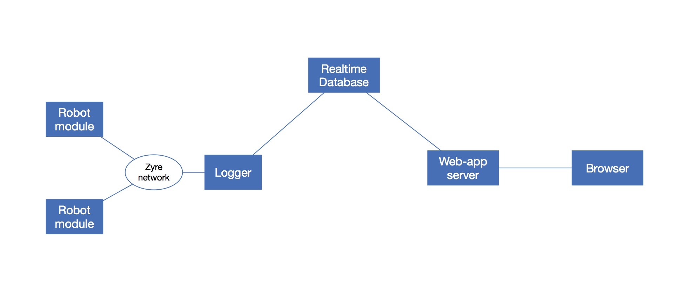
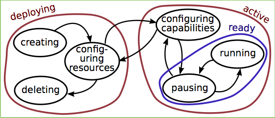

# Design decisions

## Application

The main application is generic and will visualize all the modules (and their events) in a common way. "Generic" means that each (self-declared) **group** of components share one single **communication mediator**; that one catches all events fired by the group, maybe filters them according to a (user configurable) policy, and then communicates streams to (user configurable) peers; similarly in the opposite direction: incoming streams are captured, filtered and re-distributed to the components.
A mediator can bridge communication domains (e.g., from multiple streams in the same Javascript program to a Node server, or as one Service Worker with message passing to DOM-facing Javascript components). It can also contain application "knowledge" that goes beyond the responsibility/scope of single components (e.g., which communications or visualisations to give priority to, or when and what to log to persistent storage, or which widgets to hide in a "Single Page App").

"Visualisation" is just one of the many possible components in a group; there may be more than one visualizing components. As with the communication, dedicated visualizing extensions can be written to provide better (more specific) visualizations adapted to a certain project/robot.

One application can contain multiple groups, defined by which event streams
they share. One component can be in multiple groups.

## Architecture

 

## Communication

### Coordinating initialisation: Life Cycle State Machine
Each component uses a so-called Life Cycle State Machine (a.k.a. LCSM) to initialise itself. First, it has to initialise all the "resources" that it depends on itself.

Then it passes to its “active” state, in which it is ready to provide its own "services" to the outside world; that implies, amongst other things, that it should be discoverable by other components in the network (setting up the network should be done in the “configuring resources” state)

*Every* component that is responsible for a *shared resource* must have a LCSM as described above. "Resources" come in many flavours: communication channel, hardware device, task to be executed, visualisation, etc. From the communication point of view, a LCSM is just a state machine, hence it reacts to the set of events that it is configured to realise a state transition for, and it can fire events itself, for example when it switches state. In other words, a LCSM is a stateful function, that must be embedded in a component that listens to event streams.

### Which Zyre implementation
UNCLEAR: The current one I use is the Python script from Johan. Should I use another one?

The "best" choice of Zyre implementation is determined, to a large extent, of the programming language used in the components that make use of the communication.

### Policy for tracability requirement
UNCLEAR: Should we define a policy so that the zyre <-> database mediator can communicate whether it is ready to log the events into the database? This can then be used by modules to ensure tracibility.

The logging to a database is an example of a "shareable resource" described above; hence, the logging service component should indeed use a LCSM to coordinate when it is ready to let other components make use of its logging service.

## PicknPack visualisations
### How to visualize the "web of trays"
- Modules are rectangles next to each other and a **config** file stored in the database contains the geometric information about which modules are **positioned** where.
  - Nico has already defined a [json-schema for the configuration of a module](https://gitlab.mech.kuleuven.be/rob-picknpack/pnp-line/blob/633dda2ae2d00875301e3bcc9436d2001515ec99/json_models/configuration_schema.json). But it does not include the **positioning** of the module, so a new schema and model should be made for this positioning of modules inside a line.
- Module names are visualised above their visualisation rectangles, together with their LCSM state and a small circle which colours green if the module is ready to take part in the line activity, and red if there is an **issue** that prevents it from participating to the line. The orange light is used to indicate that a green-to-red transition is imminent.
  - Currently I only have [these models](imports/rFSM) of the LCSM. They must be refactored a little bit, in order to get the transitions separated from the events that can trigger them.
  - *LCSM state transitions events* are communicated over the Zyre/browser network as any other event. As are the *stop light events*. The events model must make sure that the names of all these events are ambiguous between modules; this can be done by adding the modules GUID to the generic LCSM and stop light event names.
  - The communication protocol just communicates the ready, stop and "issue" events, and leaves it to the individual module controllers to make the decision when and why the events are fired.
- The actual web of trays:
  - This is the most challenging next thing, not just because of the geometric complexity, but also because the web grows over time.
- command buttons, to start/stop activities on modules. These are implemented as yet another FSM model, with its own set of events attached to each individual activity.

## Database

- **Structure:** We can have a configuration of
  - *i* databases
  - *j* mediators
  - *k* browser clients

  What's the balance of *i*, *j* and *k* that we will use?

- **Rethink vs mongo**: Rethink and mongo both have their (dis)advantages.
  - Rethink
    - (advantage) Has change feed API's in *Javascript, Ruby, Python and Java*
    - (disadvantage) Changefeed api is a bit sloppy (no easy way to close a feed when you are done with it, no fine-grained change updates, ...)
  - Mongo
    - (advantage) Fine-grained changefeed API
    - (disadvantage) Changefeed API only in *Javascript*

## Sherpa Extension
The extra functionalities that the Sherpa project requires compared to PicknPack is to make all activities more robust against non-perfect communication. The generic solution is by adding a communication mediator to any group of components that make use of the same communication resources. The mediator is the place to store and apply the various *Quality of Service* policies that can be defined.
