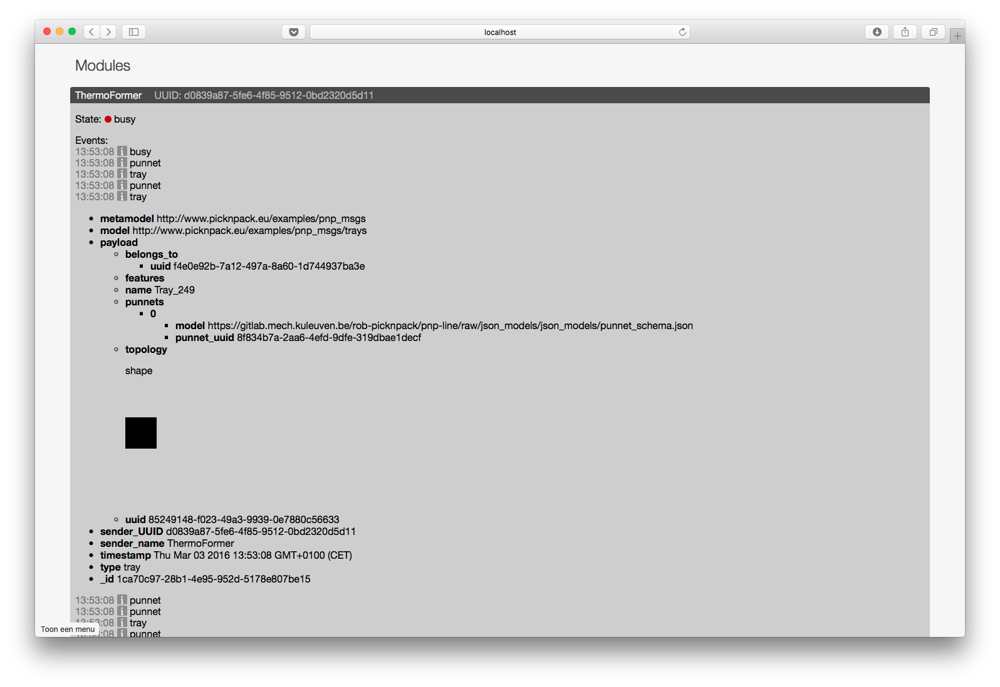
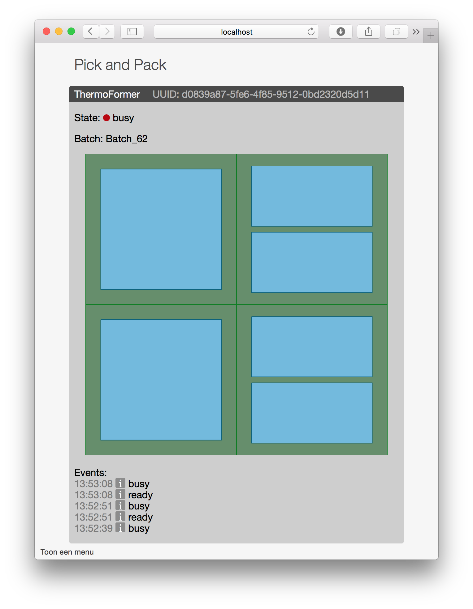

A realtime web application that allows users to

- View information about discovered robots in the network. The information contains
  - It's current state
  - What it has done in the past
  - What it will do in the future
- Send information to the robots to update it's configuration

## Usage

### Requirements

- [RethinkDB](http://rethinkdb.com/docs/install/)
  - Make sure your rethinkDB version is compatible with the version of the rethinkDB nodeJS driver (listed in `Web application/server/package.json` under dependencies).

- [Meteor](https://www.meteor.com/install)
- [Python](https://www.python.org/downloads/)

### Database
Run RethinkDB
```sh
mkdir Database
cd Database
rethinkdb
```

Create two tables in the "`test`" database

- `modules`
  - add a secondary index: `uuid`
- `events`
  - add secondary indices:
    - `sender_UUID`
    - `timestamp`
    - `type`

### Web server

Install npm modules

```shell
cd "Web application/server"
meteor npm install
cd ../client
meteor npm install
cd ../
```

Run Meteor

```sh
meteor --settings ../Configuration/webapplication.json
```

### Database mediator
```sh
cd "Robot communication/python"
python RethinkdbMediator.py
```

### Robot simulator
```sh
cd "Robot simulation/python"
python line_controller.py
```

```sh
cd "Robot simulation/python"
python thermo_former.py
```

### GUI
Open a browser and navigate to localhost:3000



